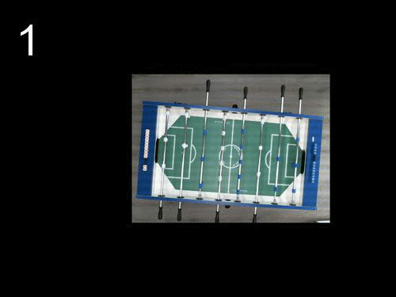
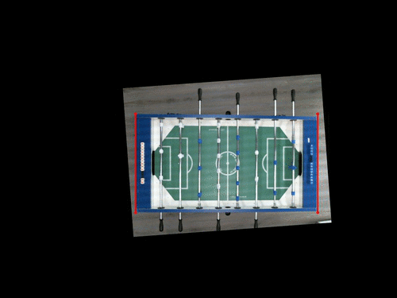
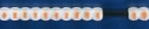
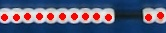
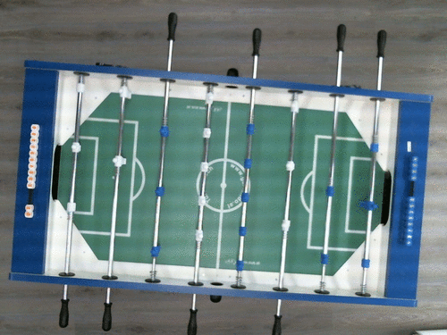

# Football score detector

The program analyzes this picture


and outputs following JSON

```json
{
  "leftScore": 9,
  "rightScore": 3
}
```

## Install

You need Python and a few **dependencies:**

- OpenCV >= 2.4.4
- Numpy
- Scipy

These might be tricky to install. I created new Ubuntu 13.10 vagrant box and installed dependencies with apt-get:

    sudo apt-get install git python-opencv python-pip python-scipy


## How it works

For example, we're finding score from this image


The images were originally in 800x600 resolution but they were resized to fit this document better.

We have a blue football table which has score "boards" for both players. Left score blocks are white and they have small orange labels on them. Right score blocks are blue and they have small white labels on them.

Goal is to count score for each player based on the score blocks' positions. In the example image left score is 1 and right score is 3.

## Algorithm

### **1. Place original image on a larger 'canvas'**

    This will prevent OpenCV from cutting image edges when rotating.

    

### **2. Rotate image so that table is straight**

    This contains a few steps

    1. Take the canvas
    2. Find blue table with HSV threshold for blue hue
    3. Find table corners from the binary(black and white) image
    4. Calculate the lower long side of table of corner points
    5. Rotate image with the found line to straighten table

    

### **3. Label table corners**

    Since the table is straightened, ordering corner points to top left, bottom left .. etc. is possible.

    

### **4. Find short table ends and score blocks based on them**

    

### **5. Crop and rotate score blocks. Then apply threshold to images**

    Left score blocks. HSV threshold for orange hue is applied.

    

    Right score blocks. Normal threshold which finds bright areas is applied.

    

    The outermost blocks are not actual score blocks. They are blocks which hold the actual score blocks in place.

### **6. Calculate score from score block images**

    Find separate objects and their centers from black and white image

    

    Now that we have 12 center coordinates for objects, we can find where the biggest gap between blocks is. From that information it is possible to count score.

### All combined



