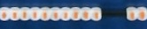

# Football score detector

The program analyzes this picture


and outputs following JSON

```json
{
  "leftScore": 9,
  "rightScore": 3
}
```

## Install

You need Python and a few **dependencies:**

- OpenCV >= 2.4.4
- Numpy
- Scipy

These might be tricky to install. I created new Ubuntu 13.10 vagrant box and installed dependencies with apt-get:

    sudo apt-get install git python-opencv python-pip python-scipy


## How it works

For example, we're finding score from this image


#### Algorithm

1. Place original image on a larger 'canvas' so that OpenCV can rotate original image without cutting edges

    

2. Rotate image so that table is straight

    This contains a few steps

    1. (Frame 2) Find blue table
    2. (Frame 3) Find corners from the image
    3. (Frame 4) Calculate the lower long side of table of corner points
    4. (Frame 5) Rotate image with the to straighten the found line

    

3. Label table corners

    Since the table is straightened, ordering corner points to top left, bottom left .. etc. is possible.

    

4. Find short table ends and score blocks based on them

    

5. Crop and rotate score blocks

    Left score blocks

    

    Right score blocks

    


